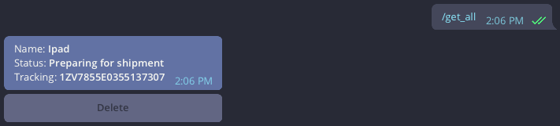

# go-els-tg-bot

<center>

|                                  |
| :-------------------------------------------------------: |
| <sup>Created with [Gopherize](https://gopherize.me)</sup> |

</center>

The project is created in educational purposes during my Go learning path.

## Idea

The idea is to have a telegram bot that will notify you when your [ELS](https://els.kg) order has new status.

## Why

Before the creation of this bot you needed to visit the page with the tracking number of your order and then copy-paste the tracking at [ELS site](https://els.kg). Now you need to visit the page once and copy-paste the order's tracking number to the bot. From that moment you don't have to do more actions. You will be notified as soon as the status of your order will be changed.

## Get started

Find @ElsGoBot in telegram. Add and type `/start`.

### `/add_tracking`

To add a tracking you need to type `/add_tracking -v="YOUR_TRACKING_NUMBER" -n="ORDER_NAME"`. Don't forget to wrap the values in commas(`"YOUR_TRACKING_NUMBER"`)!


### `/get_all`

Returns all your orders.



## Local development

Create .env file looking at [.env.example](.env.example)

Create DB container:

```
docker-compose up -d
```

Install [goose](https://github.com/pressly/goose).  
Run migrations:

```
goose -dir migrations/postgresql postgres "Here is your DB url" up
```

Install [dep](https://golang.github.io/dep/).
Run:

```
dep ensure
```

Finally, start the bot:

```
go run ./cmd/run_bot/main.go
```

## Deployment

Bot is ready to be deployed on Heroku.
Add [PostgreSQL](https://www.heroku.com/postgres), set Heroku env vars according to [.env.example](.env.example) and push.

Don't forget to set `USE_WEBHOOK=true` for production.

## TODO

- [ ] Improve logging
- [ ] Add tests
- [ ] Add Makefile
- [ ] Add Dockerfile
